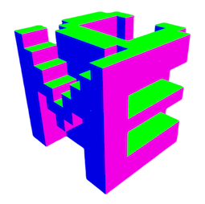
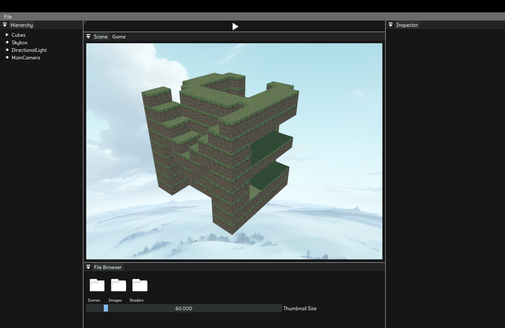

# Minecraft Engine

A game engine created for games like Minecraft and Terraria.

<!--  -->
<p align="center">
  
</p>

## Why is it

Like I said, this engine is made for Minecraft-like games, so it doesn’t have some of the fancy features you’d find in Unity or Unreal Engine. But that also means I can focus more on performance and make it run perfectly for Minecraft-style gameplay.

## What I do



- [x] Implemented rendering of squares and cubes in OpenGL using the Blinn–Phong lighting model with a single draw call.
- [x] Added basic UI support via [Dear ImGui](https://github.com/ocornut/imgui).

## How to use

1. Clone the repository.
   ```bash
   git clone https://github.com/zong4/MinecraftEngine.git
   ```
2. Install [XMake](https://xmake.io/guide/quick-start.html) if you haven’t already.
3. Build and run the project, xmake will automatically download and build the dependencies for you.
   ```bashfind . -name "*.cpp" -o -name "*.h" | xargs wc -l
   cd MinecraftEngine
   xmake run -y
   ```

## What we plan

- [ ] Add support for additional basic shapes such as spheres, cylinders, and cones, etc.
- [ ] Implement common procedural generation algorithms, including Perlin Noise and Simplex Noise, etc.
- [ ] Implement world generation techniques such as Chunked LOD and Greedy Meshing, etc.
- [ ] Implement basic physics systems (rigid bodies, collisions, forces, etc.)
- [ ] Implement physics-driven animation (ragdoll, procedural motion, and dynamic interaction)

## References:

- [OpenGL](https://learnopengl.com)
- [Game Engine Architecture](https://github.com/TheCherno/Hazel)
